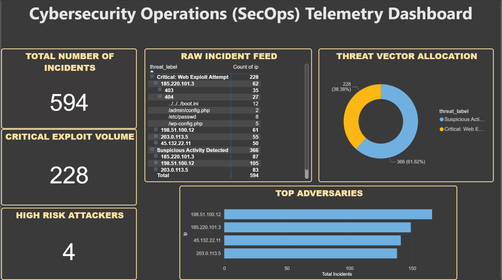

# Custom Security Log Parser & Automated Threat Triage Pipeline

## Project Overview
This project showcases a production-ready Python pipeline designed to ingest unstructured enterprise server access logs, transform the telemetry data into highly structured pandas DataFrames, and apply rule-based heuristics to isolate automated attacks, network mapping behavior, and malicious access attempts.

This script replaces slow manual inspection, enabling Tier-1 Security Operations Center (SOC) analysts to extract actionable Indicator of Compromise (IoC) datasets instantly.

## Key Core Technical Features
- **Regex Log Parsing Engine:** Utilizes optimized string matching architectures to parse raw Common Log Format (CLF) logs into individual attributes (IP, timestamp, HTTP verbs, payload destination, status codes).
- **Automated Threat Heuristics:** 
  - **Brute Force Detection:** Aggregates and isolates specific IPs exceeding failure thresholds (HTTP Status 401).
  - **Directory Traversal Defense:** Flags path intrusion payloads targeting operating system file architecture (e.g., `/etc/passwd`).
- **Incident Report Generation:** Automatically outputs highly categorized triage reports, ranking isolated alerts by analytical Risk Scores (1-10) for accelerated team escalation.

## Technologies Used
- **Language:** Python 3.x
- **Core Library:** Pandas (Utilizing optimized vectorization functions for fast data handling)
- **Deployment Mechanics:** Regex Expression Engine, File I/O automation

## How to Execute the Tool
1. Clone this repository locally.
2. Install dependencies: `pip install -r requirements.txt`
3. Run the engine: `python log_parser.py`
4. Inspect the generated triage file: `security_alerts_triage.csv`
